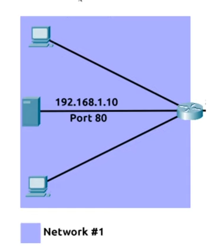
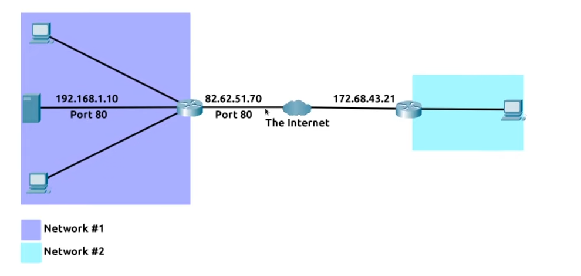
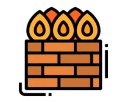
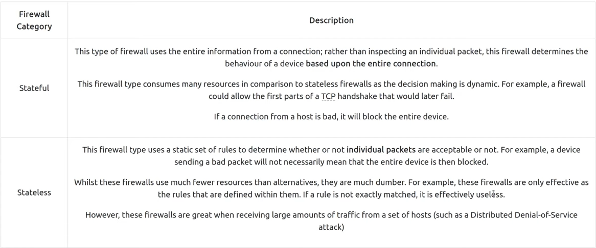
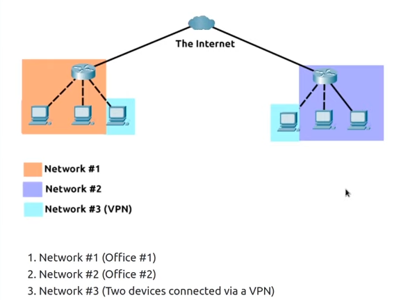
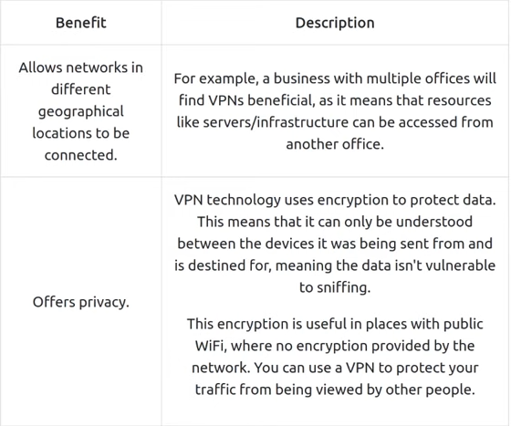
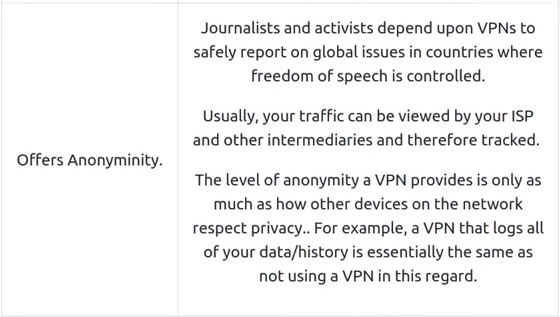
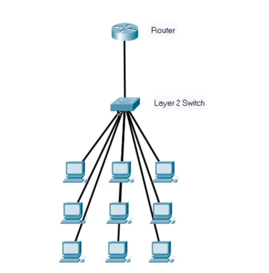
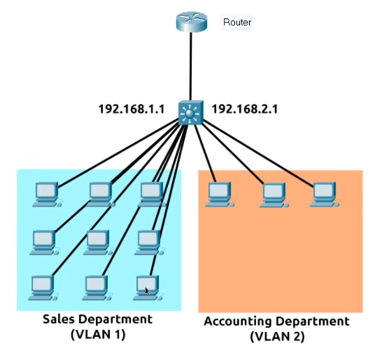

# Extending your network

## Task 1: Intro to Port Forwarding

Port forwarding is an essential component in connecting applications and services to the Internet. Without port forwarding, apps and services are only available to devices within the same direct network.

Example below, within this network, the server with IP 192.168.1.10 runs a webserver on port 80. Only the 2 other computers on this network will be able to access it

If the administrator wanted the website to be accessible to the public (using the Internet), they would have to implement **port forwarding**, like in the diagram below:

With this design, Network #2 will now be able to access the webserver running on Network #1 using the public IP of Network #1 (82.62.51.70).

Port forwarding is configured at **the router** of a network.

Don't confuse it with the behaviours of a firewall.

## Task 2: Firewalls 101

A firewall is a device within a network responsible for determining what traffic is allowed to enter and exit. (border security)

configure a firewall to `permit or deny traffic` based on:

- Where the traffic is coming from?
- Where is the traffic going to?
- What port is the traffic for?
- What protocol is the traffic using?

Firewall can be **hardware** or **software** such as `Snort`.

Summary, **the stateful firewall** inspects the entire connection and **the stateless firewall** inspects individual packets.

Firewall is at layer 3 or layer 2 or both.

## Task 4: VPN Basics

**Virtual Private Network** - technology that allows devices on separate networks to communicate securely by creating a dedicated path between each other over the Internet (known as a **tunnel**).

**Benefits**
1. Allows networks in different geographical locations to be connected.
2. Offers privacy (encrypt data)
3. Offers Anonyminity 

VPN technology has improved over the years. 

Some VPN technologies: PPP, PPTP, IPSec

## Task 5: LAN Networking Devices

+ Router (at layer 3)
+ Switch (at layer 2 and sometimes at layer 3)

+ VLAN allows specific devices within a network to be virtually split up.

