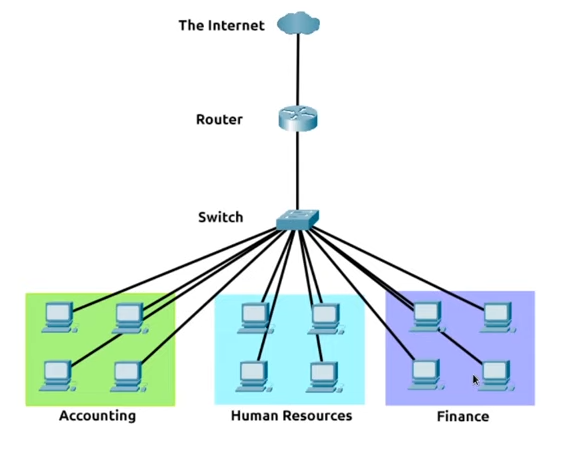

# Introduction to LAN

Learn about some of the technologies and designs that power private networks

## Task 1: Introducing LAN Topologies

`topology = the design or look of the network at hand.`

### Star Topology

devices are individually connected via a central networking device such as a switch or hub. 

This topo is more expensive than any of the other topologies because of its cabling and the purchase of dedicated networking equipment.

### Bus Topology

This type of connection relies upon **a single connection** (backbone cable). This topo is cost-efficient to set up but easy to down because of packet collision.

## Ring Topology

devices such as computers are connected directly to each other to form a loop.

a fault such as cut cable or broken device will result in the entire networking breaking.

## What is a Router?

Router is a networking device that creates **a path between networks** so that this data can be sucessfully delivered. This process is called **Routing** by using IP protocol.

Router is useful when devices are connected by many paths, such as in the example diagram below:

## What is a Switch?

Switches are dedicated within a network that aggregate multiple other devices, plug into a switch's port.

Switches are usually found in larger networks such as businesses, shools, or similar-sized networks.

Unlike Routers, Switches do not perform **routing** in the sense of directing paths along a certain route using the IP protocol. Instead, Switches use a technology called **packet switching** to break down pieces of data into smaller, more manageable chunks of data call packets.

Both Switches and Routers can be connected to one another to increase the redundancy of a network by adding multiple paths for data to take.

**Questions**
1. What does LAN stand for?
    

        
Click to reveal the answer

        Local Area Network
    

2. What is the verb given to the job that Routers perform?
   

        
Click to reveal the answer

        Routing
   

3. What technology do Switches use to break large pieces of data into smaller, more manageable packets?
   

        
Click to reveal the answer

        Packet Switching
   

4. What topo is cost-efficient to set up?
   

        
Click to reveal the answer

        Bus Topology
   

5. What topology is expensive to set up and maintain?
   

        
Click to reveal the answer

        Star Topology
   

## Task 2: A Primer on Subnetting

Subnetting is the term given to splitting up a network into smaller, miniature networks within itself. 

Subnets use IP addresses in three different ways:
- Identify the network address
- Identify the host address
- Identify the default gateway

Subnetting provides a range of benefits including:
- Efficiency
- **Security**
- Full control

**How about the security of subnetting:** \
For example: the typical cafe' have 2 networks: one for employees and one for general public to use as a hotspot.

**Questions**

1. What is the technical term for dividing a network up into smaller pieces?
    

        
Click to reveal the answer

        Subnetting
    

2. How many bits are in a subnet mask?
   

        
Click to reveal the answer

        32
   

3. What is the range of a section (octet) of a subnet mask?
   

        
Click to reveal the answer

        0-255
   

4. What address is used to identify the start of a network?
   

        
Click to reveal the answer

        Network Address
   

5. What address is used to identify devices within a network?
   

        
Click to reveal the answer

        Host Address
   

6. What is the name used to identify the device responsible for sending data to another network?
   

        
Click to reveal the answer

        Default Gateway
   

## Task 3: The ARP protocol

**Address Resolution Protocol** is the technology that is responsible for allowing devices to identify themselves on a network.

associate its MAC address with an IP address on the network.

When devices wish to communicate with another, they will **send a broadcast** to the entire network searching for the specific device and then the device that has the exactly MAC address will reply it.

### How does ARP work?

Each device within a network has a cache that store the identifiers of other devices on the network.

**ARP Request** will send a broadcast message to every other device found on a network by the device, asking whether or not the device's MAC address matches `the requested IP address`. It's like : "Who has IP address X? Tell the MAC address for me."

Ip the device does have `the requested IP address`, an **ARP Reply** is returned to the initial device to acknowledge this.

ARP is a protocol in the Network layer of the TCP/IP model, but interacts closely with Layer 2 - Datalink layer.

**Questions**

1. What does ARP stand for?
   

        
Click to reveal the answer

        Address Resolution Protocol
   

2. What category of ARP Packet asks a device whether or not it has a specific IP address
   

        
Click to reveal the answer

        Request
   

3. What address is used as a **physical identifier** for a device on a network?
   

        
Click to reveal the answer

        MAC Address
   

4. What address is used as a **logical identifier** for a device on a network?
   

        
Click to reveal the answer

        IP Address
   

## Task 4: The DHCP protocol

IP addresses can be assigned either manually, by entering them physically into a device, or automatically and most commonly by using a DHCP server - **D**ynamic **H**ost **C**onfiguration **P**rotocol. 

- DHCP Discover: BROADCAST
- DHCP Offer: UNICAST
- DHCP Request: BROADCAST
- DHCP Ack: UNICAST

**Question**
1. What type of DHCP packet is used by a device to **retrieve an IP** address?
   

        
Click to reveal the answer

        DHCP Discover
   

2. What type of DHCP packet does a device send once it has been offered an IP address by the DHCP server?
    

        
Click to reveal the answer

        DHCP Request
   

3. Finally, what is the last DHCP packet that is sent to a device from a DHCP server?
    

        
Click to reveal the answer

        DHCP Ack
    

