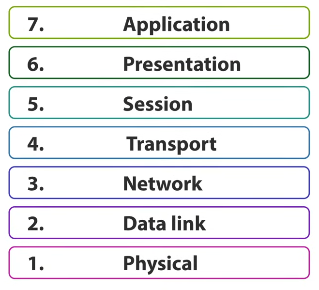
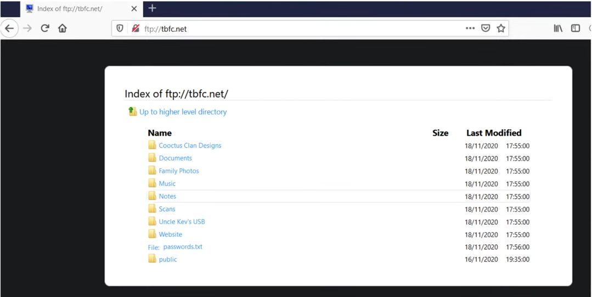
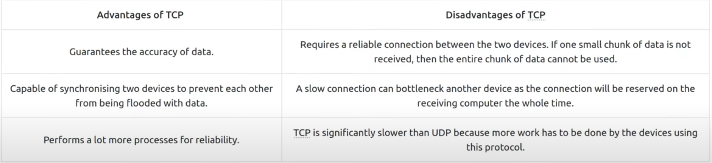
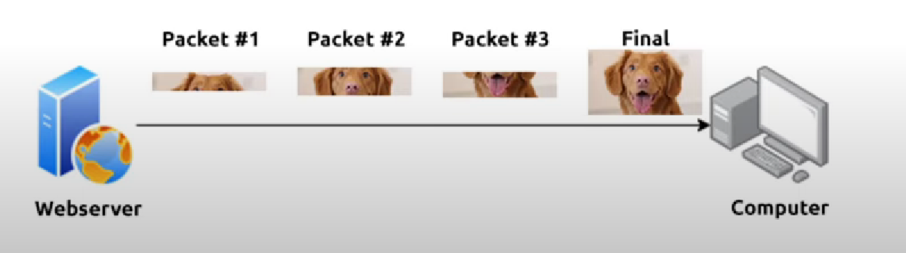
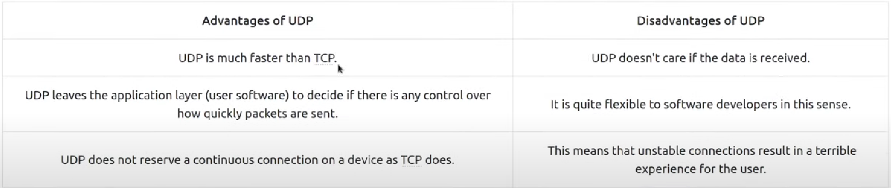
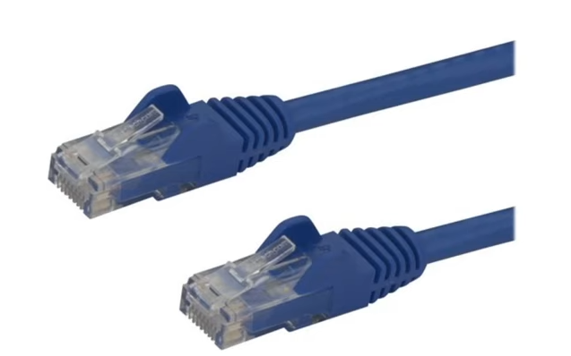

# OSI Model

## Task 1: What is the OSI Model?

**O**pen **S**ystems **I**nterconnection **M**odel

The critical model provides a framework which descripts how all networked devices will send, receive and interpret data.

At every individual layer that data travels through, a specific processes take place and pieces of info are added to this data, we call this process `Encapsulation`

## Task 2: Layer 7 - Application

The application layer is the layer in which protocols and rules are in place to determine how the user should interact with data sent or received.

Email client, Browser, File server browsing software such as FileZilla provid a friendly, **Graphical User Interface (GUI)** for users to interact with data sent or received.

Other protocols include DNS which is how website addresses are translated into IP addresses.

## Task 3: Layer 6 - Presentation

This layer acts as a **translator** for data and from the application layer (layer 7). The receiving computer will also understand data sent to a computer in one format destined for in another format.

For example: 2 users use 2 different email clients but the contents of the email will still need to display the same.

Security features such as data encryption (HTTPS) occur at this player.

## Task 4: Layer 5 - Session

Once data has been correctly translated or formatted from `the presentation layer`, `the session layer` will begin to create a connection to the other computer that the data is destined for.

And when a connection is established, a session is created.

The session layer (layer 5) **synchronises the two computers to ensure that they are on the same page** before data is sent and received. Once these checks are in place, the session layer will begin to divide up the data sent into smaller chunks of data and begin to send these chunks (packets) one at time.

The sessions are unique! Data only travel a session.

## Task 4: Layer 4 - Transport

A vital part in transmitting data across a network. There are 2 different protocols that are decided based upon several factors:
- TCP (Transmission Control Protocol) --> reliability and guarantee, error checking.
- UDP (User Datagram Protocol) --> there is no synchronisation between 2 devices or guarantee, just hop for the best and fingers crossed.

How layer 4 works?

Let's move onto the UDP:

--> UDP use for stream video, discovering devices (ARP, DHCP, DNS, ...)

## Task 5: Layer 3 - Network

Where the magic of routing and re-assembly of data takes place.

Routing simply determines the most optimal path in which these chunks of data should be sent by using some algorithm such as `OSPF` (Open Shortest Path First) and RIP (Routing Information Protocol)

Some factors that decide what route is taken is decided:
- What path is the shortest?
- What path is the most reliable?
- Which path has the faster physical connection?

## Task 6: Layer 2 - Data Link

focusing on the physical addressing of the transmission.

receiving a packet from layer 3 (include IP address) and adding in MAC address of the receiving endpoint.

every NIC comes with a unique MAC address to identify it.

## Task 7: Layer 1 - Physical

reference the physical components of the hardware used in networking.

Devices use electrical signals to transfer data between each other in a binary numbering system (1's and 0's).

For example, **ethernet cables** connecting devices, such as in the diagram below:

