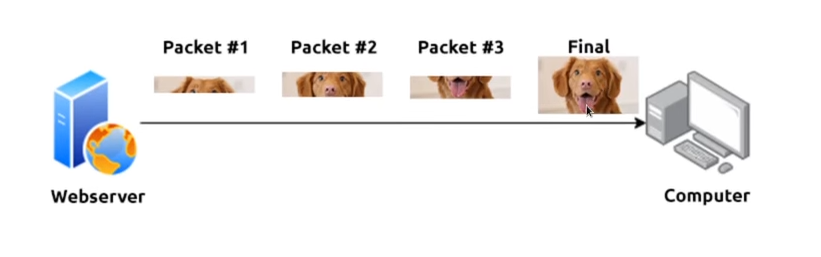
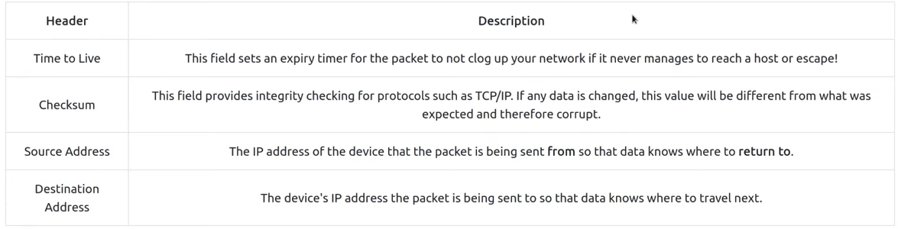
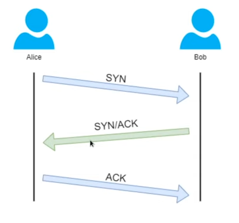
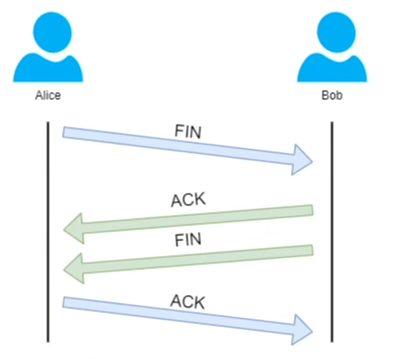
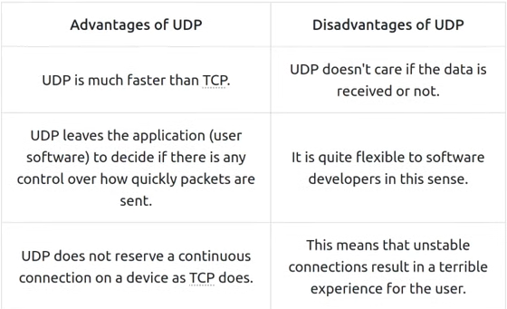
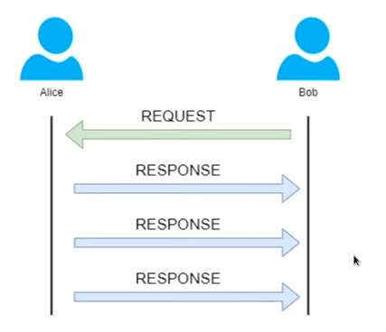

# Packets & Frames

Understand how data is divided into smaller pieces and transmitted across a network to another device.

## Task 1: What are Packets and Frames

small pieces of data, forming together to make a larger piece of information or message

a frame is at layer 2, there is no IP address. \
Think of this as putting an envelope within an envelope and sending it away. The first envelope will be the packet that you mail (this envelope will contain IP address), and the second is the frame without IP address.

The packet is at layer 3 using the Internet Protocol (IP protocol) with some information below:

**Questions**

1. What is the name for a piece of data when it does have IP addressing information?
    

        
Click here to reveal the answer

        Packet
    

2. What is the name for a piece of data when it does not have IP addressing information?
    

        
Click here to reveal the answer

        Frame
    

## Task 2: TCP/IP (The Three-Way Handshake)

**Transmission Control Protocol** is another one of these rules in networking

Three-way handshake to establish TCP connection

TCP closing a connection:

## Task 3 Practical - Handshake

## Task 4: UDP/IP

**User Datagram Protocol** is another protocol that is used to communicate data between devices.

Unlike TCP, UDP is **stateless** protocol that doesn't require a constant connection between 2 devices for data to be sent. It doesn't need 3-way handshake.

The diagram below shows a normal UDP connection between Alice and Bob:

## Task 5: Ports 101 (Practical)

Ports have 16 bits (a numerical value between 0 and 65535).

Any port that is within 0 and 1024 is known as a **common port**. 

| **Protocol** | **Port Number** | **Description** |
|----------|-------------|-------------|
| File Transfer Protocol (FTP) | 21 | This protocol is used by a file-sharing application built on a client-server model, meaning you can download files from a central location. |
| Secure Shell (SSH) | 22 | This protocol is used to securely login to systems via a text-based interface for management. |
| HyperText Transfer Protocol (HTTP) | 80 | This protocol powers the World Wide Web (WWW)! Your brower uses this to download text, images and videos of web pages. |
| HyperText Transfer Protocol Secure (HTTPS) | 443 | This protocol does the exact same as above; however, securely using encryption. |
| Server Message Block (SMB) | 445 | This protocol is similar to the File Transfer Protocol (FTP); however, as well as files, SMB allows you to share devices like printers. |

> Know more common protocols with their common ports on google.