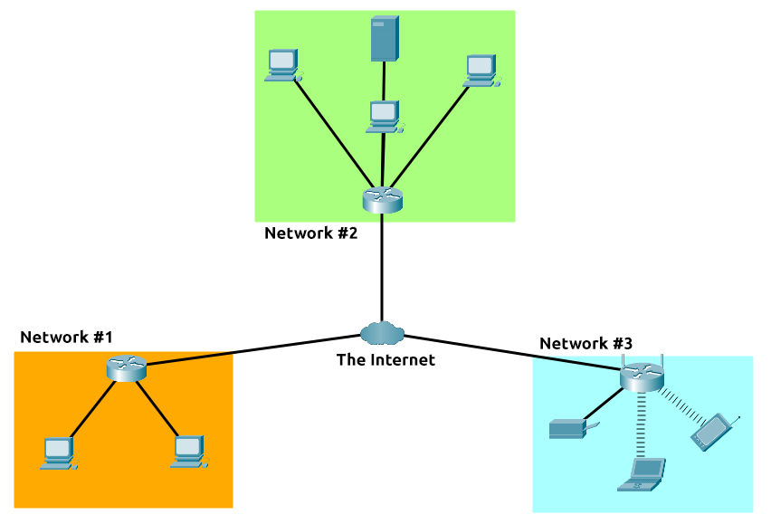
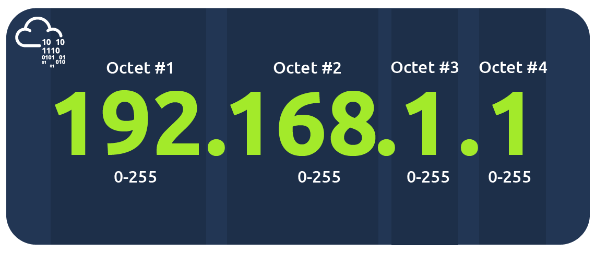
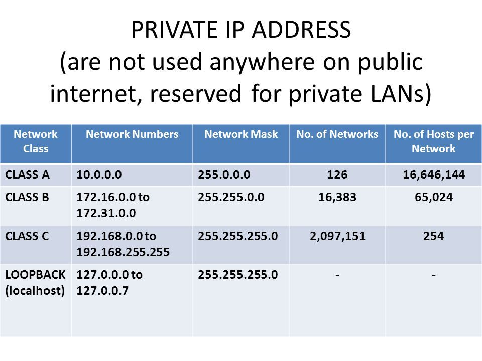
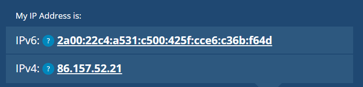
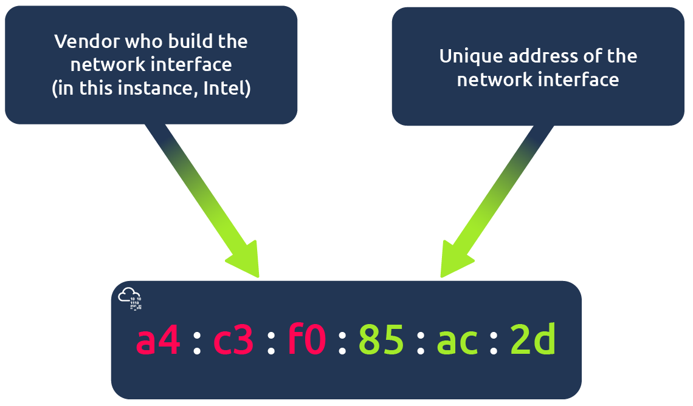
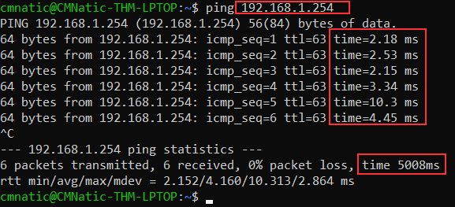

# What is Networking?

Begin learning the fundamentals of computer networking in this bite-sized and interactive module.

## Task 1: What is Networking?

Networks are simply things connected.

In computing, a network can be formed by anywhere from 2 devices to billions. These devices include everything from your laptop and phone to security cameras, traffic lights and even farming.

## Task 2: What is the Internet?

The Internet is one giant network that consists of many, many small networks within itself.

**The Network of Networks**



The Internet is made up of many small networks all joined together. These small networks are called `private networks`, and where networks connecting these small networks are called `public networks` -- or the Internet!

## Task 3: Identifying Devices on a Network

Devices on a network are very similar to humans in the fact that we have two ways of being identified:

- An Internet Protocol (IP) Address ~ Our Name
- A Media Access Control (MAC) Address ~ Our Fingerprints

### IP Addresses:

--> A way of identifying a host on a network for a period of time.



There are 2 types of IP address: public IP address and private IP address.



The rest is public IP addresses. Public IP addresses are given by your **I**nternet **S**ervice **P**rovider (or **IPS**) at a monthly fee.

As more and more devices become connected, it is becomming increasingly harder to get a public address that isn't already in use. So far we have only discussed one version of IP address known as IPv4, which uses a numbering system of 2^32 IP addresses.

IPv6 is a new version of IP addressing scheme, it supports up to 2^128 of IP addresses, resolveing the issues faced with IPv4 and has more efficient due to new methodologies.



### MAC Addresses:

All devices on a network have a physical network interface, which is a microchip board found on the device's motherboard.

This network interface is assigned a **unique address** at the factory it was build at, called a `MAC` (Media Access Control) address. 



> 48 bits = 12 hex numbers = 6 hex of vendor + 6 hex of network interface (unique)

But MAC addresses can be faked or `spoofed` in a process known as `spoofing`. 

This spoofing occurs when a networked device pretends to identify as another using its MAC address. 

> For example: a firewall is configured to allow any communication going to and from the MAC address of the administrator. If a device were to pretend or "spoof" this MAC address, the firewall would now think that it is receiving communication from the administrator when it isn't.

Places such as cafes, coffee shops, hotels, ... often use MAC address control when using their "Guest" or "Public" Wi-Fi. This configuration could offer better services: faster connection for a price if you are willing. 

## Task 4: Ping (ICMP)

Ping is one of the most fundamental network tools available to us. 

Ping uses **ICMP** (**I**nternet **C**ontrol **M**essage **P**rotocol) packets to determine the performance of a connection between devices (exist or reliable).

Syntax: 
```bash
$ ping < IP address or website URL >
```



we've just sent 6 `ICPM packets`, and all of which were received with an average time of 4.16 seconds.

That's all.