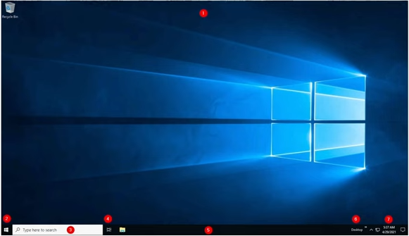
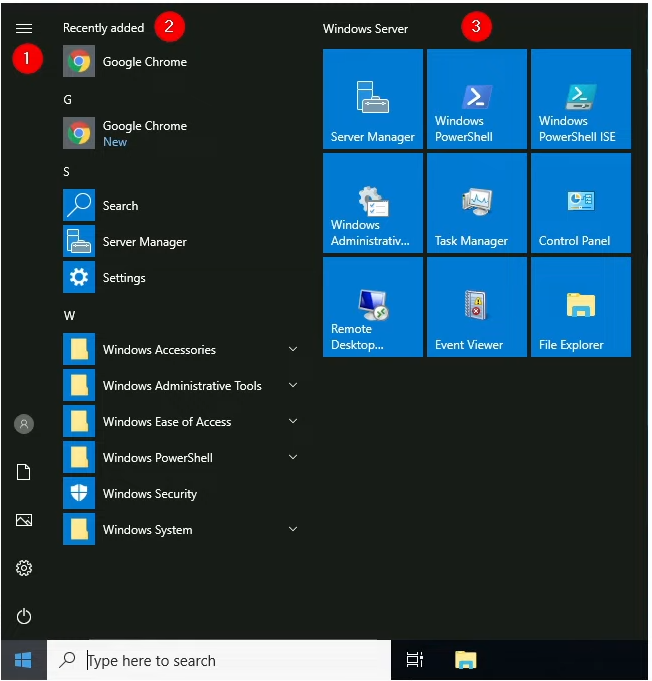
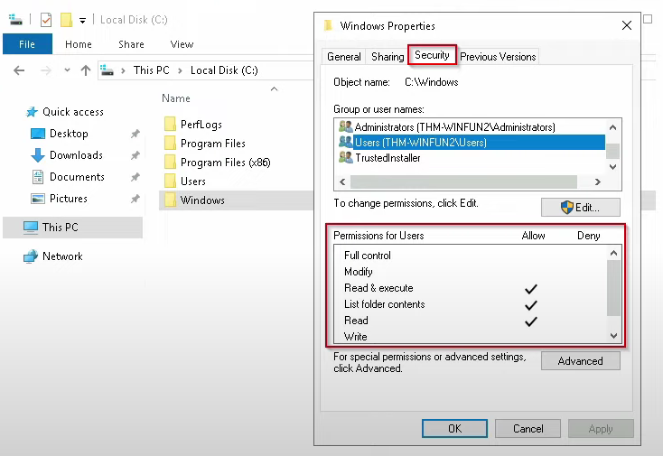
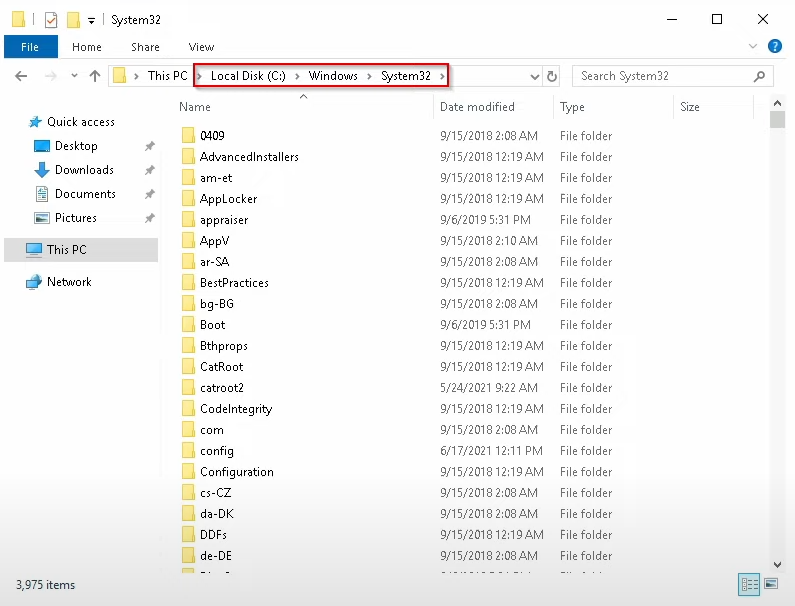
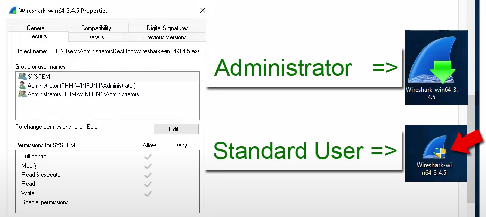
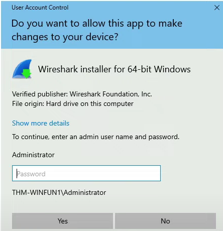

# Windows Fundamentals 1

In part 1 of the Windows Fundamentals module, we'll start our journey learning about the Windows desktop, the NTFS file system, UAC, the Control Panel, and more...

## Task 1: Introduction to Windows

The Windows OS is a complex product with many system files, utilities, settings, features, etc.

## Task 2: Windows Editions

Windows OS has a long history dating back to 1985, and currently, it's the dominant OS in both home use and corporate network.

Because of this, Windows has always been targeted by hackers & malware writers.

Windows XP, Windows Vista in the past.

Windows 7, Windows 8.x

Windows 10 comes in 2 flavors: Home and Pro. We also have Windows 10 Enterprise, Windows 10 Education.

You can see the differences between these editions [here](https://quantrimang.com/cong-nghe/so-sanh-su-khac-nhau-giua-cac-phien-ban-windows-10-160360) in vietnamese,

Or [here](https://liliputing.com/differences-between-windows-10-home-pro-enterprise-and-education/) in english

Windows 11.

## Task 3: The Desktop GUI

1. The Desktop
2. Start Menu
3. Serch Box (Cortana)
4. Task View
5. Taskbar
6. Toolbars
7. Notification Area

### The Desktop

Where you will have shortcuts to programs, folders, files, etc...

### Start Menu

Click the windows logo at the left bottom corner.

### Taskbar

Any apps/programs, folders, files, etc., that you open/start will appear in the taskbar. And when you close any of these items, they will disappear from the taskbar (unless you explicitly pinned it to the taskbar)

You can configure some other components from here such as toolbars, search box, task view ....

## Task 4: The File System

modern version of Windows: **New Technology File System** or `NTFS`

before `NTFS`, there was `FAT16`/`FAT32` (**File Allocation Table**) and `HPFS` (High Performance File System).

You still see FAT partitions in use tody in USB devices, MicroSD cards, ... 

NTFS is known as a journaling file system: in case of a failure, the file system can automatically repair the folders/files on disk using information stored in a log file.

This function is not possible with FAT

NTFS addresses many of the limitations of the previous file systems:

+ Supports files > 4GB
+ Set specific permissions 
+ compression
+ encryption

How to check the permissions of a file/folder? Right click and choose `Properties`

## Task 5: The Windows/System32 folders

The Windows folder ( `C:\Windows` ) is known as the folder which contains the Windows OS.

> This is where environment variables come to play: `%windir%`

There are many folders here, and one of them is **System32**, which contains the important files that are critical for  the OS.

## Task 6: User Accounts, Profiles, and Permissions

2 types of user: Administrator & Standard User.

+ An **Administrator** can make changes to **the system**: add users, delete users, modify groups, modify settings, ...
+ A **Standard User** can only make changes to **folders/files** attributed to the user & can't perform system-level changes, such as install programs.

How to add new user.

You can manage users and groups by the following steps:
1. Windows + R
2. type `lusrmgr.msc`, short for **local user and group management**

## Task 7: User Account Control

The large majority of home users are logged into their Windows systems as local administrators which have the elevated privileges. This increases the risk of system compromise because it makes it easier for malware to infect the system.

--> To protect the local user with such privileges, Microsoft introduced **User Account Control** (UAC). Note: UAC by default doesn't apply for the built-in local administrator account.

How does UAC work? When a user with an account type of administrator logs into a system, the current session doesn't run with elevated permissions. When an operation requiring higher-level privileges needs to execute, the user will be prompted to confirm if they permit the operation to run.

Before install a program(ex: Wireshark), we can see:

This shield icon is an indicator that UAC will prompt to allow higher-level privileges to install the program.

Double click the program, and you'll see the prompt:

## Task 8: Settings and the Control Panel

+ Windows + I to quickly open Settings.

## Task 9: Task Manager

+ Ctrl + Shift + Esc to quickly open Task Manager.