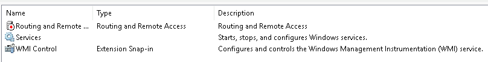

# Windows Fundamentals 2

In part 2 of the Windows Fundamentals module, discover more about System Configuration, UAC Settings, Resource Monitoring, the Windows Registry and more..

## Task 1: Introduction
We've already known about the desktop, user account control (UAC), the control panel, settings, and the task manager in Part 1.

And in this part, we're gonna try to review some other utilities available within Windows OS.

## Task 2: System Configuration

The **System Configuration** - MSConfig is for advanced troubleshooting and help diagnose startup issuses.

*Note:* We need local administrator rights to open this utility.

1. General

We can select what devices and services for Windows to load upon boot

2. Boot

We can select various boot options for the OS

3. Service

Listing all services configured for the system regardless of their state (running or stopped).

A service is a special type of app that runs in the background.

4. Startup

> the **MSConfig** utility is not a startup management program.
>
> Microsoft advises using **Task Manager** `taskmgr` to manage (enable/disable) startup items.

5. Tools

The tools/utilities and their brief description.

**Questions:**
1. What is the name of service that lists Systems Internals as the manufacturer?
+ Notice the service that its manufacturer is Systems Internals.
    

        
Click here to reveal the answer!

        PsShutdown.
    

2. Whom is the Windows license registered to?
+ In tab `Tools`, launch `About Windows`..
    

        
Click here to reveal the answer

        Windows User
    

3. What is the command for Windows Troubleshooting?
+ Observing carefully tab `Tools`
    

        

        C:\Windows\System32\control.exe /name Microsoft.Troubleshooting
    

4. What command will open the Control Panel? 
    

        
Click here to reveal the answer

        control.exe
    

## Task 3: Change UAC Settings

User Account Control was covered in greet detail in [Windows Fundamentals](../Part%201/README.MD)

The UAC settings can be changed or even turned off entirely (not recommended).

**Question**

1. What is the command to open UAC settings? 
    

        
Click here to reveal the answer

        UserAccountControlSettings.exe
    

## Task 4: Computer Management

The Computer Management (`compmgmt`) utility has 3 primary sections: **System Tools**, **Storage**, and **Services and Applications**.

1. System Tools

- `Task Scheduler`: We will create and manage common tasks that the computer will carry out automatically at time we specify.

    

- `Event View`: allow us to view events that have occured on the computer. --> use it to diagnose problems and investigate actions executed on the system.

    

    The standard logs are visible under **Windows Logs**.
- `Shared Folders`: where you will see a complete list of shares and folders shared that others can connect to.

    

- `Local Users and Groups`: it's `lusrmgr.msc`

- `Performance`: Performance Monitor (perfmon) - view performace data either in real-time or from a log file. 

    

- `Device Manager`: view and configure the hardware, such as disable any hardware attached to the computer.

    

2. Storage

There are 2 sessions, we'll only look at `Disk Management`

Disk Management is a system utility in Windows that enables you to perform advanced storage tasks:

- Set up a new drive
- Extend a partition
- Shrink a partition
- Assign or change a drive letter

3. Services and Applications

A services is a special type of application that runs in the background.

**Question:**
1. What is the command to open **Computer Management**?
    

        
Click here to reveal the answer

        compmgmt.msc
    

2. At what time everyday is the GoogleUpdateTaskMachineUA task configured to run?
    

        
Click here to reveal the answer

        6:15 AM
    

3. What is the name of the hidden folder that is shared?
    

        
Click here to reveal to answer

        sh4r3dF0Ld3r
    

## Task 5: System Information

What is the **System Information (msinfo32)**?

> Per Microsoft: "*Windows includes a tool called `Microsoft System Information (Msinfo32.exe)`. This tool gathers information about your computer and displays a comprehensive view of your hardware, system components, and software environment, which you can use to diagnose computer issues.*"

There are 3 sections on **System Summary**:
+ Hardware Resources --> this is not for average computer user
+ Components --> hardware devices
+ Software Environment --> software such as **Environment Variables**, **Network Connections**, ...

Towards very bottom of this utility, there is a search bar: 

## Task 6: Resource Monitor

What is the **Resource Monitor (resmon)**?

Per Microsoft, "*Resource Monitor displays per-process and aggregate CPU, memory, disk, and network usage information, in addition to providing details about which processes are using individual file handles and modules. Advanced filtering allows users to isolate the data related to one or more processes (either applications or services), start, stop, pause, and resume services, and close unresponsive applications from the user interface. It also includes a process analysis feature that can help identify deadlocked processes and file locking conflicts so that the user can attempt to resolve the conflict instead of closing an application and potentially losing data.*"

In the Overview tab, `Resmon` has four sections:
+ CPU
+ Disk
+ Network
+ Memory

And each tab has additional information for each.

## Task 7: Command Prompt

**cmd**

There are 2 types to interact with computer
+ via GUI (what is introduced until now)
+ via CLI (this is command prompt)

In early operating systems, the command line was the sole way to interact with the OS. 

Let's start with a few simple commands:
+ `hostname`: output the computer name

    

+ `whoami`: output the name of the logged-in user

    

+ `ipconfig`: show the network address settings for the computer.

    

+ `/?`: retrieve the help manual for a command

    

+ `cls`: clear the command prompt screen.
+ `netstat`: display protocol statics and current TCP/IP network connections.

    

+ `net`: manage network resources

## Task 8: Registry Editor

Windows Registry is a hierarchical database used to store information necessary to configure the system for one or more users, applications, and hardware devices.

The registry contains information that Windows continuelly references during operation, such as:
+ Profiles for each user
+ Applications installed on the computer and the types of documents that each can create
+ Property sheet settings for folders and application icons
+ What hardware exists on the system
+ The port that are being used

**Warning**: The registry is for advanced computer users. Making changes to the registry can affect normal computer operations. 

There are various ways to view/edit the registry. One way is to use the **registry editor (regedit)**

The command to open the Registry editor is `regedt32.exe`.

## Task 9: Conclusion

Recall that the tasks covered in this room were some of the tools that can launch from `MSConfig`. But you don't have to launch msconfig to run these utilities.

You can also run these utilities from the Start Menu.

