# Windows Fundamentals 3

## Task 1: Introduction

To summarize the previous two rooms:
+ In [Windows Fundamentals 1](../Part%201/), we covered the desktop, the file system, user account control, the control panel, settings, and the task manager
+ In [Windows Fundamentals 2](../Part%202/), we covered various utilities, such as System Configuration, Computer Management, Resource Monitor, etc.

This module will attempt to provide an overview of the security features within the Windows OS: Windows Updates, Windows Security, BitLocker, etc.

## Task 2: Windows Updates

Updates are typically released on the 2nd Tuesday of each month. This day is called **Patch Tuesday**

**Tip**: Another way to access Windows Update is from the **Run dialog box**, or **CMD**, by running the command `control /name Microsoft.WindowsUpdate`.

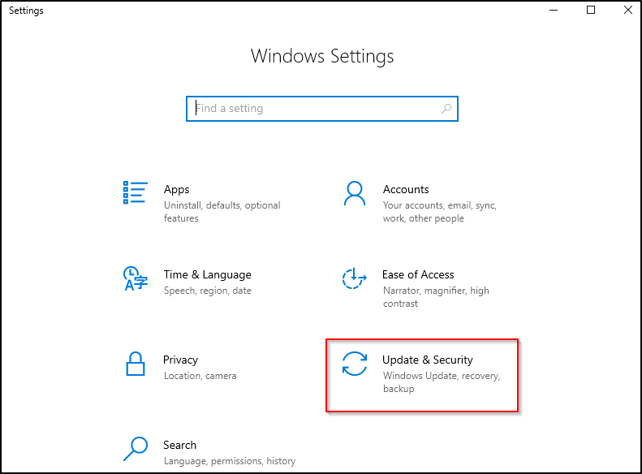

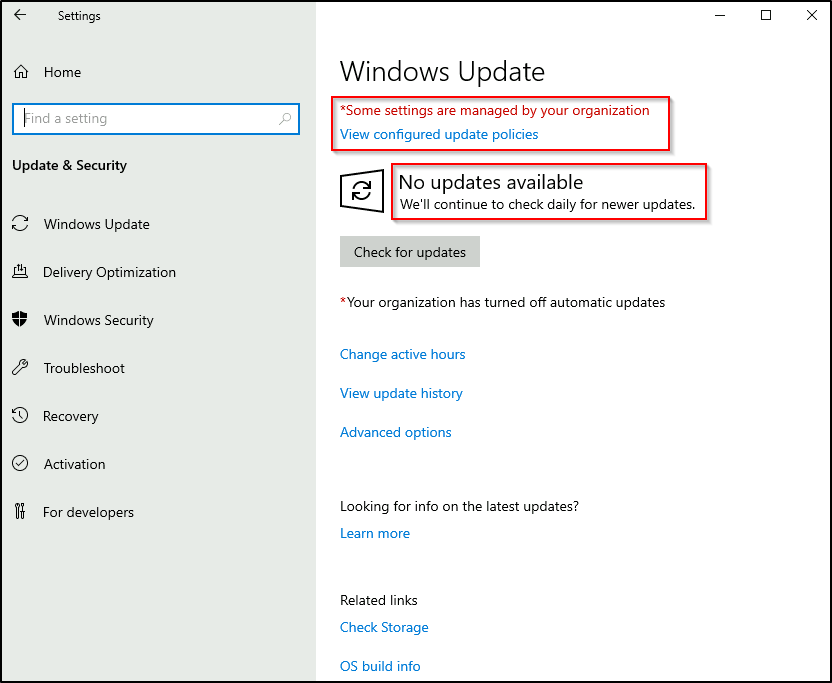

After update, you need to reboot your computer to apply the changes

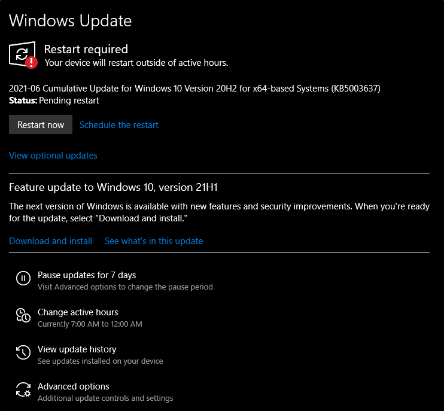

## Task 3: Windows Security

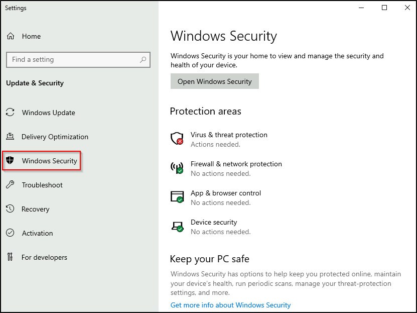

Focus your attention on **Protection areas**:
+ Virus & threat protection
+ Firewall & network protection
+ App & browser control
+ Device security

The Status Icons:
+ **Green** - your device is protected
+ **Yellow** - there is a safety recommendation for you to review
+ **Red** - a warning that something need your immediate attention

Click **Windows Security**:

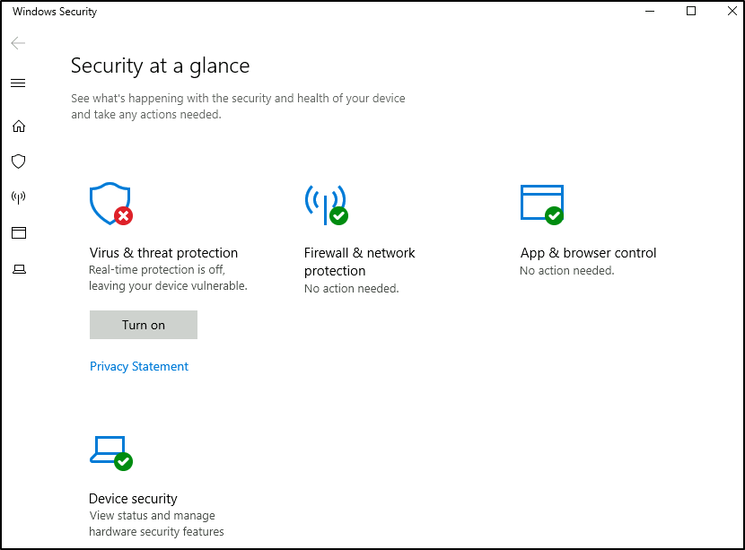

or bellow (depending on windows version)

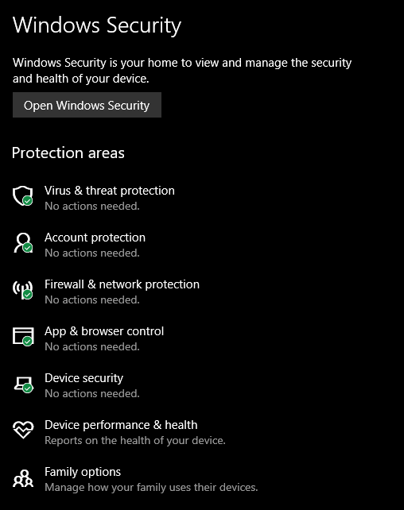

## Task 4: Virus & threat protection

2 parts:
+ Current threats
+ Virus & threat protection settings

### 1. Current threats

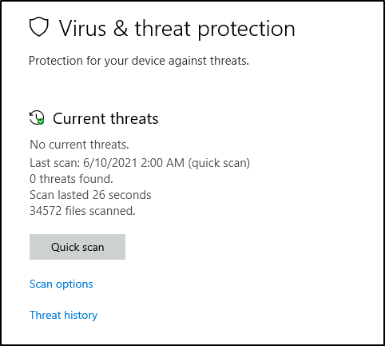

Scan options:
+ Quick scan - checks folders where threats are commonly found
+ Full scan - checks all files and running programming on your hard disk. this scan could take longer than 1 hour
+ Custom scan - choose which files and locations you want to scan

Threat history
+ Last scan
+ Quarantined threats
+ allowed threats

### 2. Virus & threat protection settings

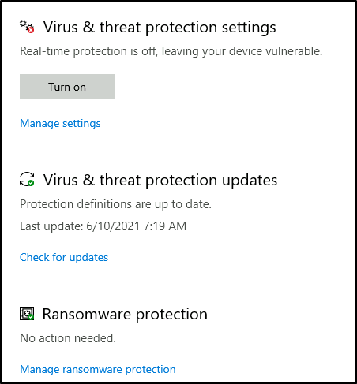

**Manage settings**
+ Real-time protection - locate and stop malware from installing or running on your device
+ cloud-delivered protection - provide increased and faster protection with access to the lastest protection data in the cloud.
+ ...
+ Exclusions - Windows Defender Antivirus won't scan items that you've excluded. (only use this option if you're 100% sure of what you're doing)
+...

**Virus & threat protection updates**
**Ransomware protection**

Note: real-time protection is turn off in the attached VM to decrease the chance of performance issues

## Task 5: Firewall & network protection

What is a **firewall**?

Per Microsoft: "*Traffic flows into and out of devices via what we call ports. A firewall is what controls what is - and more importantly isn't - allowed to pass through those ports. You can think of it like a security guard standing at the door, checking the ID of everything that tries to enter or exit*"

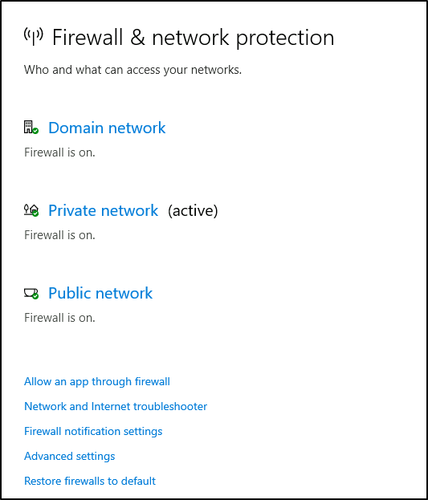

windows firewall offers 3 firewall profiles: domain, private and public.

What is the difference between the 3 (**Domain**, **Private**, and **Public**)?
+ Domain - applies to networks where the host system can authenticate to a domain controller (domain networks). --> all computers are registered and managed centrally under a domain controller (usually in business environments)
+ Private - for home networks, all computers inside can communicate without internet.
+ Public - default profile, used to designate public networks such as Wi-Fi hotsports at coffee shops, ...

**Allow an app through firewall**

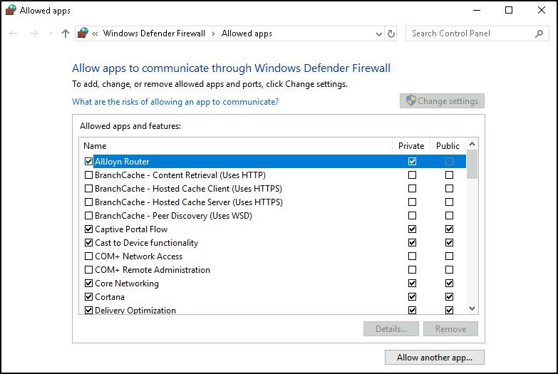

View what the current settings ofr any firewall profile are.

**Advanced Settings**

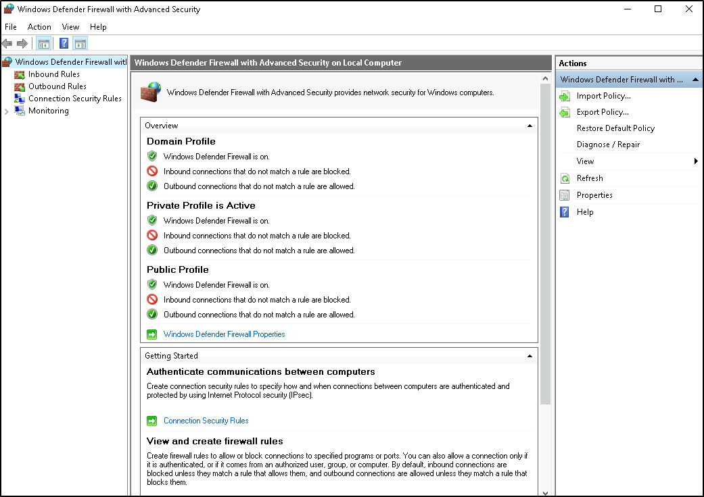

## Task 6: App & Browser control

In this section, you can change the settings for the **Microsoft Defender SmartScreen**.

Per Microsoft: *Microsoft Defender SmartScreen protects against phising or malware websites and applications, and the downloading of potentially malicious files.*

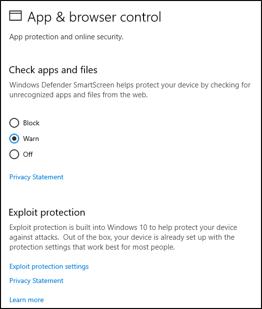

### Check apps and files: Windows Defender SmartScreen helps protect your device by checking for unrecognized apps and files from the web

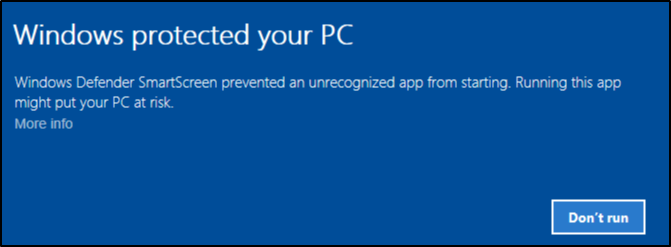

### Exploit protection: it is built into Windows 10 to help protect your device against attacks.

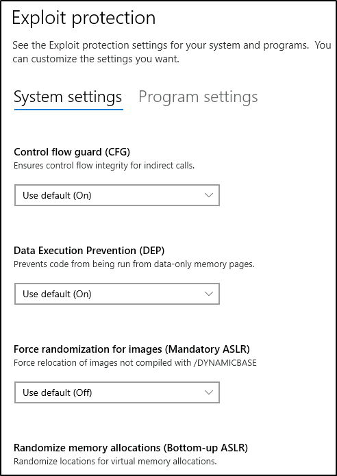

**Warning**: Unless you are 100% confident in what you are doing, it is recommended that you leave the default settings. 

## Task 7: Device Security

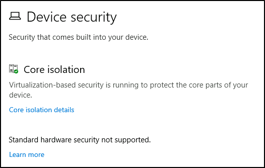

1. Core isolation
  - Memory Integrity - Prevents attacks from inserting malicious code into high-security processes.

    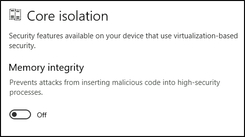

2. Security processor 

  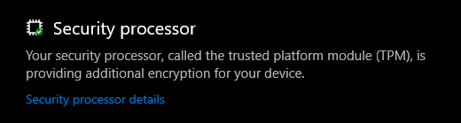

  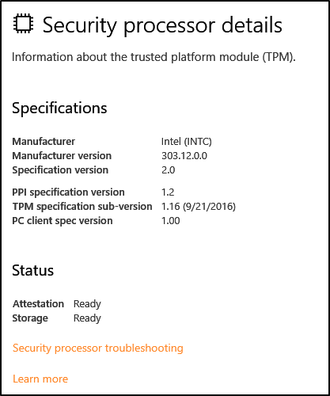

What is **Trusted Computing Base (TCB)** or **Trusted Platform Module (TPM)**?

TCB/TPM technology is designed to provide hardware-based, security-related functions. A TCB/TPM chip is a secure crypto-processor that is designed to carry out cryptographic operations.The chip includes multiple physical security mechanism to make it tamper-resistant, and malicious software is unable to tamper with the security function of the TCB/TPM.

## Task 8: BitLocker

- BitLocker Drive Encryption

- USB startup key

## Task 9: Volume Shadow Copy Service

VSS - volume shadow copy service 

## Task 10: Conclusion
