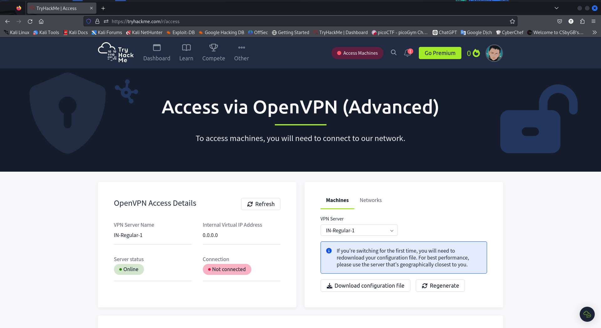

# Try Hack Me

This directory contains my notes when i walk through `learning paths` on platform **TryHackMe**.

Have 2 options to access target machines:
1. Using `AttackBox` in the website (it's limited 2 hours for free user and doesn't work smoothly)
2. Access via OpenVPN (i recommends you to use this way)

When the way 2, you need to download vpn configuration file from the web.
 

then open your local terminal, run this file by `root` to connect remote network through vpn tunnel.

In this case, my configuration file is in `~/Download/` directory. After connect, you can see an ip address at top-right corner. It's the vpn ip address. Press `ctrl + shift + t` to open another terminal working space. 

Double check:\
`$ ifconfig`\
`$ ip addr`

It's all now! 